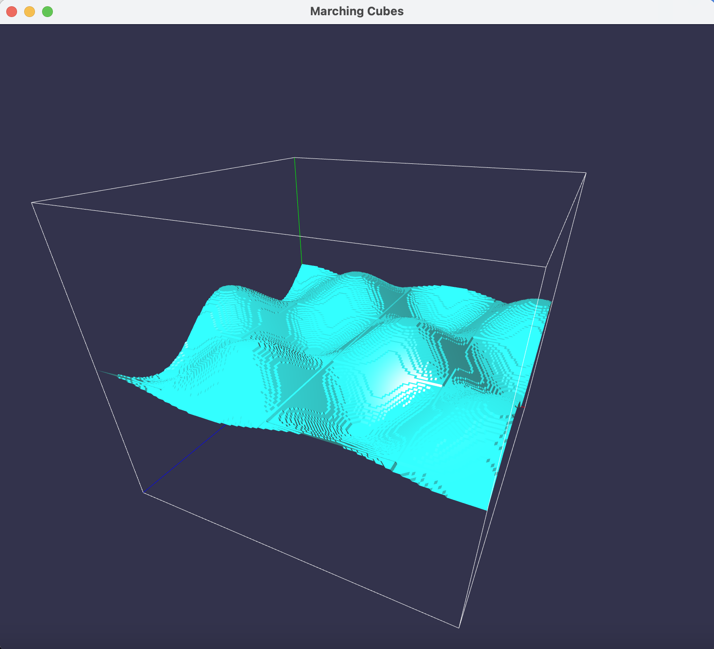
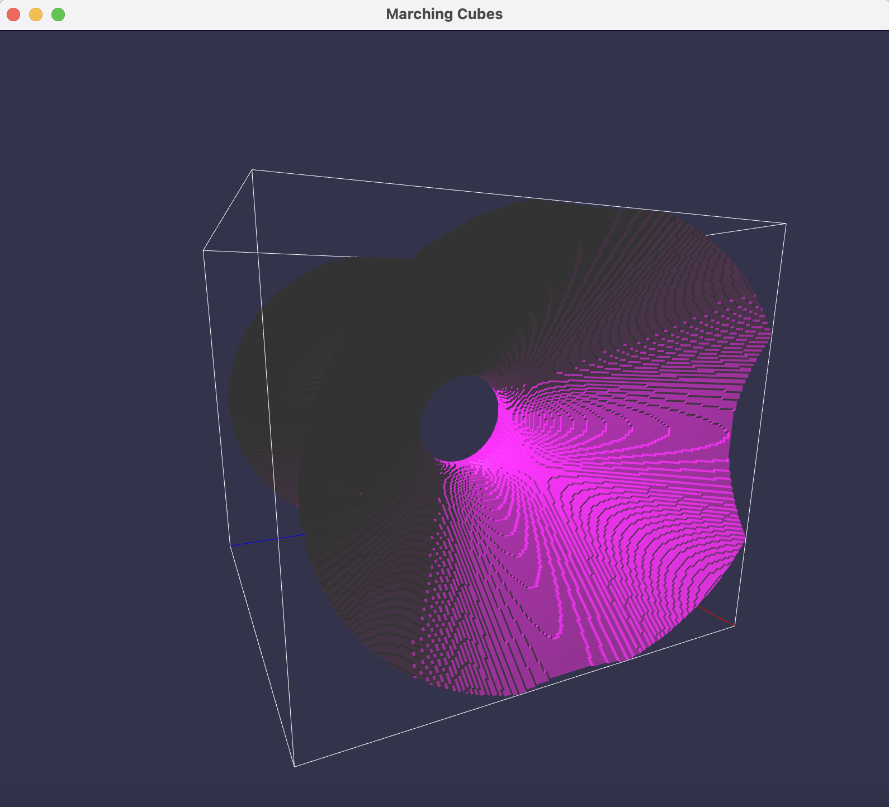

==============
Marching Cubes
==============

Overview
========

Python OpenGL program to generate triangle meshes of various scalar fields using the
marching cubes algorithm.

Requirements
============

The program requires ``pyopengl``, ``glfw``, ``pyglm``, and ``numpy``. For help
setting up a new Python environment and downloading the packages, check out my
beginner PyOpenGL tutorial, `Hello Triangle<https://github.com/joelenehales/hello-triangle>`_!

Using the Program
=================

The program is divided into two modules to optimize performance:

:marching_cubes.py: Generates triangle meshes and saves the data to a PLY file

:render.py: Opens the triangle mesh data from a PLY file and renders the result

Generating Triangle Meshes
--------------------------

Triangle meshes are generated with the marching cubes algorithm. To generate a
triangle mesh of a scalar field, execute

.. code-block:: bash

    python marching_cubes.py filename scalar_field isovalue volume_min volume_max
    stepsize

Parameters
^^^^^^^^^^

:filename: | Filename of the PLY file to write triangle mesh data to.

:scalar_field: | Name of the scalar field defining the object to generate a triangle mesh for.
               | *Options*: 
               |  wavy : Scalar field :math:`f(x,y,z) = y - \sin{(x)} \cdot \cos{(z)}`
               |  hyperboloid : Scalar field :math:`f(x,y,z) = x^2 - y^2 - z^2 - z`

:isovalue: | Boundary value used to define which points are considered to be inside of the object.
           |   If f(x, y, z) < isovalue, then the point (x, y, z) is considered to be inside of the object. If f(x, y, z) > isovalue, then the point (x, y, z) is considered to be outside of the object.

:volume_min: | Minimum value of x, y, and z to use in the algorithm.

:volume_max: | Maximum value of x, y, and z to use in the algorithm.

:stepsize: | Side length of each cube in the algorithm. A smaller stepsize will result in more vertices in the triangle mesh.

Rendering Triangle Meshes
-------------------------

To render a saved triangle mesh, execute

.. code-block:: bash

    python render.py filename volume_min volume_max colour

Parameters
^^^^^^^^^^

:filename: | Filepath to the PLY file containing the triangle mesh's attributes.

:volume_min: | Minimum value of x, y, and z in the marching volume. For best results, this should match the value used to generate the triangle mesh.

:volume_max: | Maximum value of x, y, and z in the marching volume. For best results, this should match the value used to generate the triangle mesh.

:colour: | Name of the object's base colour. Used as the diffuse component of the lighting model.
        | *Options*: turquoise, fuschia
        |  If not specified, turquoise is used by default.

To render the object, the program uses a Phong-like shader which combines the
the ambient, diffuse, and specular components of light to compute the
object's colour. A box is drawn around the marching volume, with the x, y, and z
axes indicated in red, green, and blue respectively. Once the scene is rendered,
the cube can be rotated in place by clicking and dragging the mouse. The camera
can be zoomed in and out using the up and down arrow keys respectively.

Examples
========

Example PLY files that can be used to experiment with the program have been
provided in the directory *MeshFiles*. The parameters used to generate each
triangle mesh are included as a comment in the file. The following images show
each triangle mesh rendered. The code to generate and render each triangle mesh
is included in the caption.

| Texture mesh generated of the wavy scalar field. 
|  Generated using: :code:`python marching_cubes.py MeshFiles/wavy-example.ply wavy 0 -5 5 0.05`
|  Rendered using: :code:`python render.py MeshFiles/wavy-example.ply -5 5 turquoise`

| Texture mesh generated of the hyperboloid scalar field.
|  Generated using: :code:`python marching_cubes.py MeshFiles/hyperboloid-example.ply hyperboloid -1.5 -5 5 0.05`
|  Rendered using: :code:`python render.py MeshFiles/hyperboloid-example.ply -5 5 fuchsia`